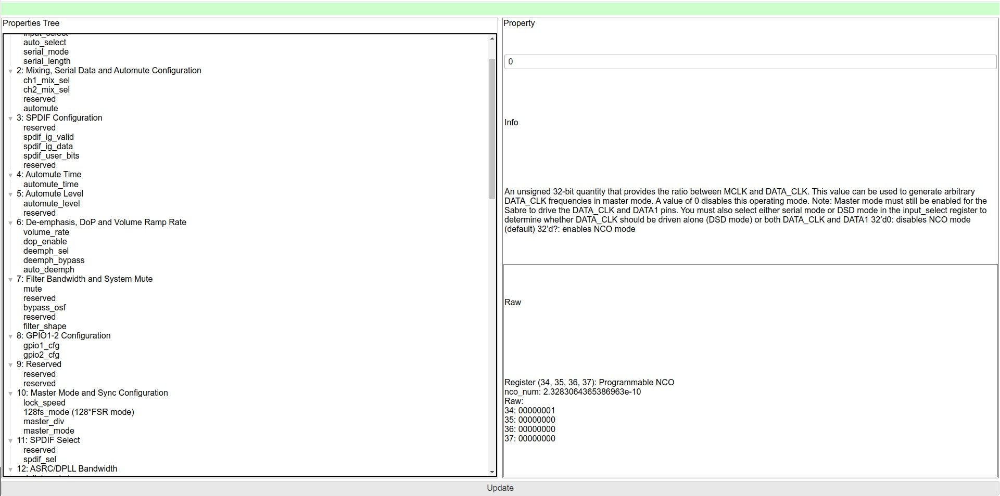

# SABRE_I2C_Controller
## Introduction
### ⚠ Caution: Use at your own risk! 
### The software is only in beta mode and some functions are not working correctly. Please be sure to make an backup of the i2c registers before playing with the tool as it edits settings on firmware level which can also destroy your setup on its worst case.

<br>

## What it does
A simple i2c controller gui that allows to edit sabre controller (e.g. ES9038) configurations.


## Features
As the the Sabre [ES9038Q2M advanced datasheet](http://file2.dzsc.com/product/18/05/25/829029_170233543.pdf) is freely available online this project aims to implement the DAC datasheet into a simple interface. For this reason a small API was implemented to decode and encode the register data.
<br>

The GUI is based on flexx an easy to manage web interface that allows to configure the DAC on an headless RPI via browser.

<br>
Standard port is set to 5000. The application is listening on all connections.
The app uses the SMBUS2 library to communicate via I2S with the dac cores.
In it's current configuration it is configured to control an dual ES9038Q2M configuration as <em>IAN CANADA Dual Mono ES9038Q2M DAC HAT</em> is offering (Device IDs 0x48, 0x49).
All configurations are applied to both DACs at the same time (except channels at Reg 2, because they need to be different).

<br><br>

Currently the following configurations are still not working properly:  

Reg 4: Automute time   
Reg 6: Volume rate  
Reg 14: Soft Start Configuration  
Reg 30-31: Charge Pump Clock  
Reg 34-37: Programmable NCO  

I will complete them as soon I've time.

Please be free to also contribute to this project to make it even more usefull (e.g. add ES9038Pro Control).

## How to run
You need Python 3.7.

Install the requirements.txt
<br>
```bash
cd *project_directory* <br>
pip3 install -r requirements.txt
```

**Start the application**
```bash
cd *project_directory* <br>
python3 ./web_gui.py
```

Open your browser and navigate to: http://device_ip:5000/ControlApp/


## How should it look like



